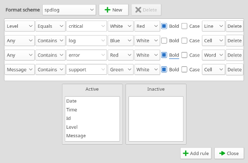
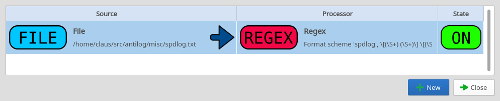
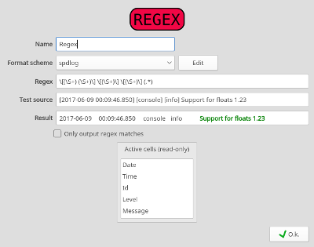
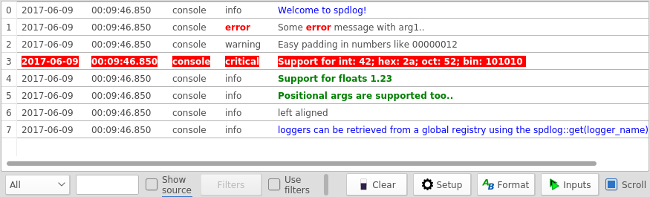
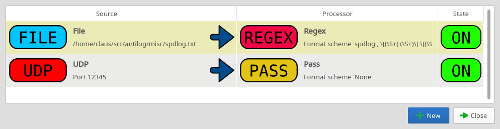

[](https://travis-ci.org/bjerrep/antilog)

# antilog

Antilog is a small and naive graphical logviewer.  It attempts to make it simpler to monitor a number of log sources in one central place with e.g. filters that can be changed at runtime. Antilog will also as any application save and reload its configuration between application runs. So compared to tail and grep unrestricted flexibility is replaced with a hopefully more userfriendly tool.

The idea is to have a single logviewer that can monitor different sources simultaneously with different formats with regard to e.g. date and time fields or having no special formats at all. It doesn't support e.g. color formatting made by the logging applications but instead formats log messages from user specified formatting rules made in the antilog application itself. Log data will typically originate from realtime tail'ing of log files or by explicitly capturing stdout from applications lauched on a commandline.

Antilog is a working prototype and is not ready for real life deployment. It has newer been used for anything remotely serious. It is put here on github in the hope that someone might find it interesting for whatever reason, maybe even for viewing logs.

## building

Although written in Qt build configuration is done with cmake. Make a standard cmake out-of-source build:

```
mkdir build && cd build
cmake ..
make
```
Binaries can then be found in ./bin. Building has so far only been done with Qt 5.9 on linux. There are no extraordinary dependencies for building except cmake & Qt. For building on ubuntu the .travis.yml file might give some clues for building on older ubuntu releases.


## executables

There are 3 executables after a full build, antilog (the logviewer), antiudp (stdout to udp) and antitestui (an ad-hoc log generator used for testing)

### antilog

This is the viewer application. Typically the first thing to do is to make a formatting scheme for a source, followed by a input configuration linking a source to a processor. 

#### Formatting scheme
Here a formatting scheme is made that matches the output from the [spdlog](https://github.com/gabime/spdlog) example application. The fields in the 'active' view are predefined but can be reordered to match e.g. the output groups from a regex processor. The only field that have any special meaning is 'Level' which can be used in the log view to filter out unwanted log levels.

 

#### Input configuration

Next a input is configured, the source is a file filereader set up to load a log file containing the spdlog texts (available in ./misc) and the processor is regex based and parses the spdlog default formatting. There can be an arbitrary number of such input configurations.

 

For instance the regex processor configuration dialog looks like this:

 

These are the input sources implemented so far:

- **Dir**. Run individual tails on all specified files recursively below a specified root. E.g. on all files below /var/log in one go.
- **File**. Run a tail on a specified file. The last part of the file can be loaded as well if desired.
- **UDP**. Treats each received datagram as a log message.

These are the available processors:

- **Pass**. Just show the log data as-is.
- **Regex**, Parse log messages as regex groups. These groups will then be labelled e.g. date, time, severity etc.

#### Log viewer

The final screenshot is the actual logview. The formatting implementation is not quite there yet. Whenever a formatting rule has hit on a line no further formatting rules are applied to the specific line. That needs to get fixed as a alot of other things do.

 

The pulldown in lower left corner sets the threshold for the severities to display and any text in the textfield to the right will act as an grep filter. The "Use filters" will harvest source names and module names on the fly if checked. If checked this will in turn enable a dialog where it is possible to enable or disable individual source/module combinations and to give them individual severity thresholds.
The antilog configuration file is saved in json format in ~/.config/antilog. 

### antiudp

A small console app that captures stdout and sends the log messages on a udp socket (netcat style). Here is a second input configuration adding a UDP source

 

and now the following line will send the live spdlog example output into the logviewer.

```
../spdlog/build/example/example | ./bin/antiudp
```
### antitestui

A development app for e.g. writing to a logfile for the antilog viewer to tail. Oddly enough then the antilog application itself doesn't really produce any log output.


## licence

GPLv2
